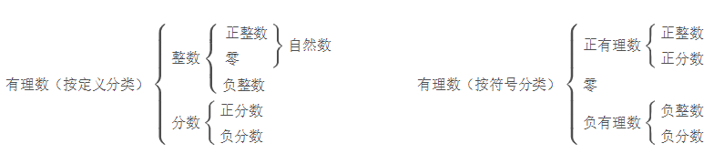
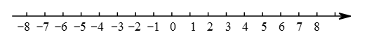

# 七年级上

## 1. 有理数

### **1.有理数**

【注意】**有限小数**和**无限循环小数**都可以转化为分数，因此有限小数和无限循环小数都是有理数．

### **2.数轴**

数轴：规定了**原点**，**正方向**和**单位长度**的直线．

【注意】任何一个有理数都可以用数轴上的点来表示，但数轴上的点并不都表示有理数，如数轴上表示π的点表示的就不是有理数，因为π是无限不循环小数，不是有理数．

### **3.相反数**

相反数的特性：

若a,b互为相反数，则a + b = 0，反之亦然

数字a的相反数是-a (注意:这里的a不一定是整数)

### 4.绝对值

数轴上表示数a的点与原点的距离叫作数a的绝对值，记作 |a|。

如下图，A，B两点分别表示3和-3，它们与原点的距离都是3个单位长度，3和-3都的绝对值都是3。

**绝对值的代数意义**

一个正数的绝对值是它本身，一个负数的绝对值是它的相反数，0的绝对值是0.

 

**绝对值的几何意义**

一个数的绝对值就是表示这个数的**点到原点的距离**。

**绝对值的性质**

非负性，绝对值总是大于或等于0

如果若干个非负数的和为0，那么它们一定都是0

### 5.有理数的加减乘除

1.加法交换律：两个数相加，交换加数的位置，和不变
$$
a + b = b + a
$$
2.加法结合律：三个数相加，先把前两个数相加，或者先把后两个数相加，和不变
$$
(a+b)+c=a+(b+c)
$$
3.乘法交换律：两数相乘，交换因数的位置，积相等
$$
a*b = b*a
$$
4.乘法结合律：三个数相乘，先乘前两个或先乘后两个，积相等
$$
a*(b*c) = (a*b)*c
$$
5.乘法分配律：一个数同两个数的和相乘，等于把这个数分别同这两数相乘，再把积相加
$$
a*(b+c)=a*b+a*c
$$

### 6.有理数的乘方

**定义**

求n个相同因数的积的运算，叫作乘方，乘方的结果叫幂。

在a^n中，a叫底数，n叫指数。

当a^n看作a的n次方的结果时，也可读作a的n次幂
$$
a*a*a*...*a,\space \space 记作a^n
$$

**法则**

1. 负数的奇次幂是负数，负数的偶次幂是正数
2. 正数的任何次幂都是正数，0的正整数次幂都是0

## 2. 整式的加减

**单项式的概念**

 式子都是**数字或者字母的积**，这样的式子叫作单项式。如：100t，0.8p，mn等；

单项式中的数字因数叫作这个单项式的**系数**。

**所有字母的指数的和叫**作这个单项式的次数，如100t的次数是1，mn的次数是2。

**多项式的概念 **

几个单项式的和叫作多项式，每个单项式叫作多项式的项，不含字母的项叫作常数项。

多项式里，次数最高项的次数，叫作这个多项式的次数。(如x^2 + 2x + 6的最高项是x^2，次数为2)

**同类项的概念**

**所含字母相同，并且相同字母的指数也相同**的项叫作同类项。(如100t 与 -200t)

合并同类项：把多项式中的同类项合并成一项，系数相加，字母和指数不变。

## 3. 一元一次方程

## 4. 几何图形初步

# 七年级下

## 5. 相交线与平行线

## 6. 实数

## 7. 平面直角坐标系

## 8. 二元一次方程

## 9. 不等式及不等式组

## 10. 数据的收集整理,描述

# 八年级上

## 11. 三角形

## 12. 全等三角形

## 13. 轴对称

## 14. 整式乘法/因式分解

## 15. 分式

# 八年级下

## 16. 二次根式

## 17. 勾股定理

## 18. 平行四边形

## 19. 一次函数

## 20. 数据的分析

# 九年级上

## 21. 一元二次方程

## 22. 二次函数

## 23. 旋转

## 24. 圆

## 25. 概率初步

# 九年级下

## 26. 反比例函数

## 27. 相似

## 28. 锐角三角函数