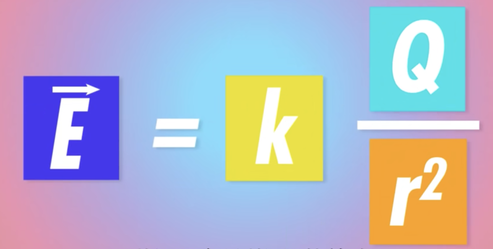
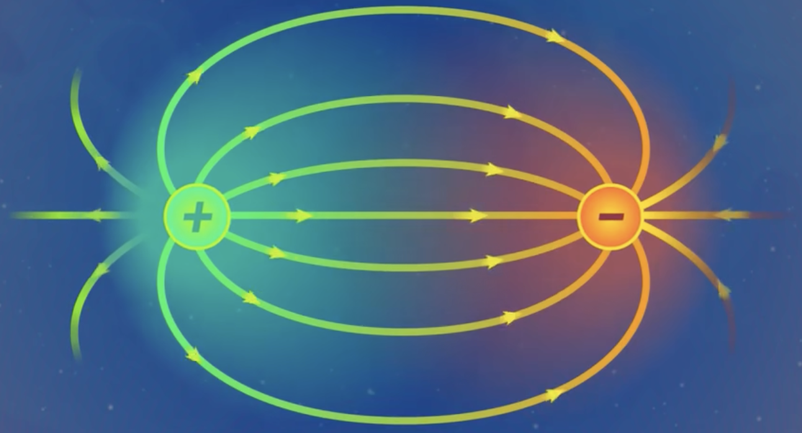
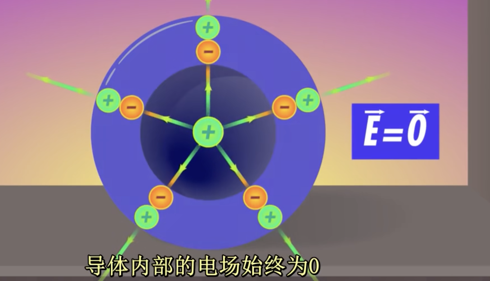

# 1.电荷

同性电荷相互排斥，异性电荷互相吸引。

**如何量化电荷之间的引力和斥力❓❓❓**

用**库伦(C)**来表示电荷q

##  **什么是 库仑（C）？**

库仑是**电荷量的单位**，定义是：

$$
1 库仑（C） = 6.242 × 10^{18} \space 个基本电荷（电子的电荷量）
$$

单个电子的电荷量是
$$
-1.6*10^{-19} \space C
$$

## 库伦定律

两个电荷作用力的表达式
$$
F = k\frac{q_1q_2}{r^2}
$$
k : 库伦常量

q : 两个电子的电荷量

r : 距离

# 2.电场

上面讨论了库伦，用于计算两个电子之间的作用力。

**但是如何电子数量超过2个呢❓**

**如果一个物体的总电荷已知，我们能知道它如何影响别的电荷吗❓**

## 电场计算公式

法拉第假设每个**带电物体周围都充斥着一个场**，对进入其中的其他粒子有力的作用。

电场通过施力，携带能量并传递给其他物体。

## 电场叠加原理

两个粒子会各自产生自己的电场。

把两个电场加起来就能得到完整的电场。

**1.任何一点的电场线的方向就是它的切线方向**

电场线的方向就是试探电荷受到力的方向。

**2.线密度越大，场强越大**

**3.电场线永远起始于正电物体，终止与负电物体**

**4.不同的电场线永不接触**

## 静电平衡

**导体中存在电场吗❓**

**电子能在材料中自由运动吗❓**

假设我们有一个带负电的球体，这些额外的自由电子想尽可能的远离彼此，这会导致它们会重新分布在球面上，这一来达到了静电平衡。

一旦达到了平衡态，加速度为0，也就是受到的合外力为0。

**当合外力为0时，电场也就为0。**

**结论：**

1.导体内部的电场始终为0

2.净电荷分布在导体表面

 

# 3.电容器

