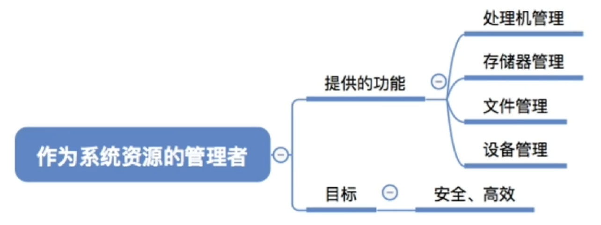
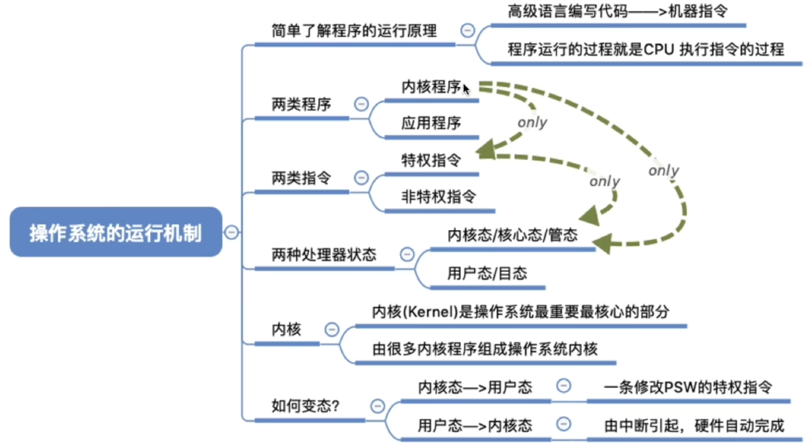
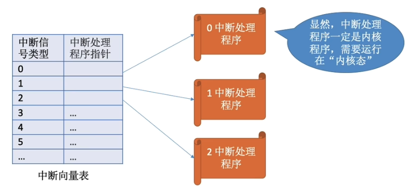
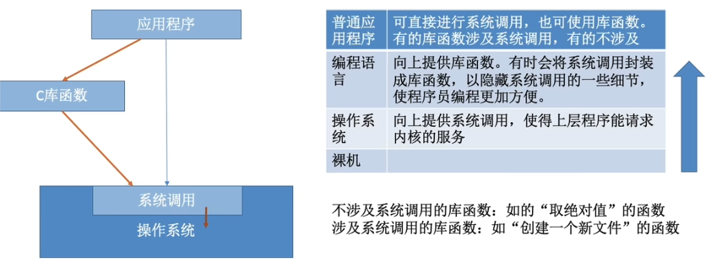
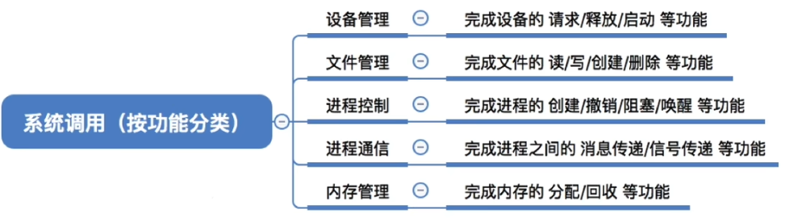

# 1.计算机系统概述

OS

1.系统资源的管理者

2.向上提供方便易用的服务

3.是最接近硬件的一层软件

## 操作系统的特征

### **并发**

2个或多个事件在同一时间间隔内发生。宏观上是同时发生的，微观上是交替发生的。

并行：2个或多个事件真的同一时刻在发生。

**注意：**单核CPU同一时刻只能执行一个程序，各个程序只能并发地进行。

### 共享

即资源共享，指系统中的资源可供内存中多个并发执行的进程共同使用。

- 互斥共享
- 同时共享

### 虚拟

把物理上的实体变为若干个逻辑上的对应物。

物理实体是实际存在的，逻辑上的对应物是用户感受到的。

**虚拟技术：**

空分复用技术(如虚拟存储器技术)

时分复用技术(如虚拟处理器)

### 异步

异步是指在多道程序环境下，允许多个程序并发执行，但由于资源有限，进程的执行不是一贯到底的，而是走走停停，以不可预知的速度向前推进，这就是进程的异步性。

## 操作系统运行机制

## 中断和异常

中断的作用：CPU上会运行两种程序，一种是操作系统内核程序，一种是应用程序。

在合适的情况下，操作系统内核会把CPU的使用权主动让给应用程序。中断是让**操作系统内核夺回cpu使用权**的唯一途径。

- 内中断(异常)：与当前执行的指令有关，中断信号来自CPU内部
- 外中断：与当前执行的指令无关，中断信号来自CPU外部

**中断机制的基本原理**

不同的中断信号，需要不同的中断处理程序来处理。

当CPU检测到中断信号后，会根据中断信号的类型去查询终端向量表，以此来找到相应的中断处理程序在内存中的存放位置。

## 系统调用

**系统调用与库函数的区别**

**什么时候需要用到系统调用？**

凡是与共享资源有关的操作(如存储分配，IO操作，文件管理等)，都必须通过系统调用的方式向操作系统内核提出服务请求，由操作系统内核代为完成。

