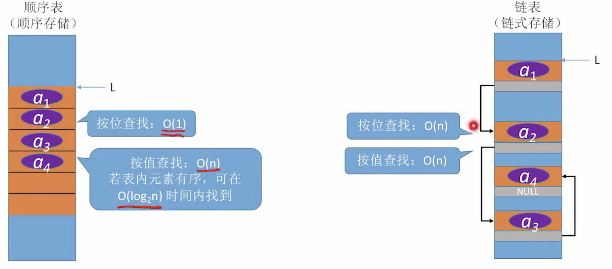

# 1.算法

**好算法的特质**

- 正确性
- 可读性
- 健壮性
- 时间复杂度低
- 空间复杂度低


## 1.1 时间复杂度

时间开销T(n)和问题规模n的关系。

**计算方法：**

多项相加，只保留最高阶，且系数化为1

多项相乘，都保留


## 1.2 空间复杂度


算法原地工作：表示算法所需内存空间为常量

**变量需要一些内存空间的开销：**

```cpp
void test(int n){
  int flag[n][n];
  int other[n];
  int i;
  //...
}
```


**函数递归调用带来的内存开销：**

```cpp
void loveYou(int n){
  int a,b,c;
  //...
  if(n>1){
    loveYou(n-1);
  }
  printf("I love you%d\n",n);
}
```

函数调用栈，最后当n=1时才结束

空间复杂度=递归调用的深度


# 2.线性表

定义：具有相同数据类型的n个数据元素的有限序列。


**线性表的基本操作：**

`InitList(&L)`初始化表。构造一个空的线性表L，分配内存空间。

`DestroyList(&L)`销毁操作。销毁线性表，并释放线性表所占的内存空间。


`ListInsert(&L,i,e)`插入操作。在表中的第i个位置上插入指定元素e。

`ListDelete(&L,i,&e)`删除操作。删除表L中的第i个位置的元素，并用e返回删除元素的值。

`LocateItem(L,e)`按值查找操作。在表L中查找具有给定关键字值的元素。

`GetItem(L,i)`按位查找操作。获取表L中第i个位置的元素的值。

其他常用操作：

`Length(L)`求表长。返回线性表L的长度，即L中的元素个数。

`PrintList(L)`输出操作。

`Empty(L)`判空操作。若L为空表，返回true，否则返回false。


## 顺序表

**定义：**用**顺序存储**的方式实现线性表。

顺序存储：把逻辑上相邻的元素存储在物理位置上也相邻的存储单元中。


### 定义

顺序表的实现 -- 静态分配

```cpp
#define MaxSize 10					//定义最大长度
typedef struct{
  ElemType data[MaxSize];		//静态的数组存放数据元素
  int length;								//顺序表的当前长度
}SqList;
```


顺序表的实现 -- 动态分配

```cpp
typedef struct{
  ElemType *data;						//动态的数组存放数据元素
  int length;								//顺序表的当前长度
  int MaxSize;							//顺序表的最大容量
}SeqList;
```

key：动态的申请和释放内存空间

```cpp
#define InitSize 10    //默认的最大长度
L.data = (ElemType*)malloc(sizeof(ElemType)*InitSize);
```


### 插入

`ListInsert(&L,i,e)`插入操作。在表中的第i个位置上插入指定元素e。

```cpp
//插入操作，pos为位序
bool ListInsert(SqList &L, int pos, int data) {
    if (pos < 1 || pos > L.length+1) return false;
    if (L.length >= MaxSize) return false;

    for(int i = L.length; i >= pos; i--) {  //将第pos元素及之后的元素往后移
        L.data[i] = L.data[i-1];
    }
    L.data[pos-1] = data;
    L.length++;
    return true;
}
```


### 删除

`ListDelete(&L,i,&e)`删除操作。删除表L中的第i个位置的元素，并用e返回删除元素的值。

```cpp
bool ListDelete(SqList &L, int pos, int &data) {
    if (pos < 1 || pos > L.length) return false;
    data = L.data[pos-1];
    for (int i = pos; i < L.length; i++) {
        L.data[i-1] = L.data[i];
    }
    L.length--;
    return true;
}
```


### 查找


**按位查找**

```cpp
ElemType GetElem(SqList L, int i){
  return L.data[i-1];
}
```


**按值查找**

```cpp
// 按值查找
int LocateElem(SqList L, int value){
    for (int i = 0; i < L.length; i++) {
        if (L.data[i] == value)
            return value;
    }
    return 0;
}
```


## 链表

### 单链表


#### 定义

```cpp
typedef struct LNode{
    int data;              //数据域
    struct LNode *next;    //指针指向下一个节点
}LNode, *LinkList;
```


**初始化一个单链表**

```cpp
//不带头结点
bool InitList(LinkList &L){
  L = nullptr;
  return true;
}

// 带头结点
bool InitList(LinkList &L){
    L = (LNode*)malloc(sizeof(LNode));
    if(L == nullptr) return false;
    L->next = nullptr;
    return true;
}
```


**判断单链表是否为空**

```cpp
// 不带头结点
bool Empty(LinkList L){
  return L==nullptr;
}

//带头结点
bool Empty(LinkList L){
  return L->next == nullptr;
} 
```


#### 插入

带头结点的

```cpp
//按位序插入
bool ListInsert(LinkList &L, int pos, int element){
    if(pos < 1) return false;
    LNode *p = L;    //指针p指向当前扫描到的结点
    int j = 0;
    while(p != nullptr && j < pos){
      p = p->next;    //找到第pos个结点的指针
      j++;
    }
    if(p == nullptr) return false;
    LNode *p2 = (LNode*)malloc(sizeof(LNode));
    p2->data = element;
    p2->next = p->next;
    p->next = p2;
    return true;
}
```

如果是不带头结点的链表，还需要在插入完成后更改头指针指向新结点。


指定结点的后插操作

```cpp
bool InsertNextNode(LNode *p, ElemType e){
  if(p==nullptr) return false;
  LNode *s = (LNode*)malloc(sizeof(LNode));
  if(s == nullptr) return false;	//内存分配失败
  s->data = e;
  s->next = p->next;
  p->next = s;
  return true;
}
```


指定结点的前插操作

```cpp
//前插操作 在p结点之前插入e元素
bool InsertPriorNode(LNode *p, int e){
  if(p == nullptr) return false;
  LNode *s = (LNode*)malloc(sizeof(LNode));
  if(s == nullptr) return false;    //内存分配失败

  // 偷天换日，总的来说就是新结点创建在p之后，把p的值给s，然后p去接新值e
  s->next = p->next;
  p->next = s;          //新结点s连接到p之后
  s->data = p->data;    //把p的元素复制给s
  p->data = e;
  return true;
}
```

或者笨一点的方法就是把头结点传过去,然后找到后继结点是p结点的结点。 


#### 删除

按位序删除(带头结点)

```cpp
//按位序删除，带头结点
bool ListDelete(LinkList &L, int pos,int &element){
    if(pos < 1) return false;
    LNode *p = L;
    int j = 0;
    while(p->next != nullptr && j < pos - 1){
      p = p->next;
      j++;
    }
    if(p == nullptr) return false;
    if(p->next == nullptr) return false;
    LNode *q = p->next;    //令q指向被删除的结点
    element = q->data;
    p->next = q->next;    //将结点q从链中断开
    free(q);
    return true;
}

//删除指定的结点p
bool DeleteNode(LNode *p){
    if(p == nullptr) return false;

    //因为找不到p结点前面的结点，除非传入头结点，所以，偷天换日
    LNode *q = p->next;            //令q指向p的后继结点
    p->data = p->next->data;       //p后面那个结点的值给p
    p->next = q->next;
    free(q);
    return true;
}
```


**单链表的局限性：**无法逆向检索，有时候不太方便


#### 查找

```cpp
//按值查找(找到数据域==e的结点)
LNode* LocateElem(LinkList L, int element){
	LNode *p = L->next;
    while(p != nullptr && p->data != element)
    	p = p->next;
    return p;
}
```


#### 单链表的建立

Step 1：初始化一个单链表

Step 2：插入表头/表尾


**尾插法：**

取一个r指针，永远指向表尾结点，每次插入的时候直接将数据插入到表尾就行


### 双链表

**定义**

```cpp
typedef struct DNode{
	ElemType data;
  struct DNode *prior, *next;
}DNode,*DLinkList;
```


初始化双链表

```cpp
bool InitDLinkList(DLinkList &L){
  L = (DNode*)malloc(sizeof(DNode));  //分配一个头结点
  if(L == nullptr) return false;
  L->prior = L->next = nullptr;
  return true;
}
```


#### 插入

```cpp
//在p之后插入s结点
bool InsertNextNode(DNode *p, DNode *s){
  s->next = p->next;
  if(p->next !=nullptr)
    p->next->prior = s;
  s->prior = p;
  p->next = s;
}
```


#### 删除


```cpp
//删除p结点的后继结点
bool DeleteNextNode(DNode *p){
  if(p==nullptr) return false;
  DNode *q = p->next;
  if(q==nullptr) return false;
  p->next = q->next;
  if(q->next != nullptr)
    q->next->prior = p;
  free(q);
  return true;
}
```


**销毁双链表**

```cpp
void DestroyDLinkList(DLinkList &L){
  //循环释放各个数据结点
  while(L->next != nullptr)
    DeleteNextNode(L);
  free(L);
  L = nullptr;
}
```


#### 遍历

```cpp
//后向遍历
while(p != nullptr)
  p = p->next;

//前向遍历
while(p != nullptr)
  p = p->prior;
```


### 循环链表


### 静态链表


**定义**

```cpp
#define MaxSize 10
struct Node{
  int data;
  int next;	//下一个元素的数组下标
};

void testSLinkList(){
  struct Node a[MaxSize];	//数组a作为静态链表
  //...
}
```


## 顺序表 vs 链表

增删：


查：




# 3.栈&队列

栈(Stack)是只允许在一端进行插入和删除操作的线性表。


**栈的基本操作**

`InitStack(&S)`：初始化栈。构造一个空栈，分配内存空间。

`DestroyStack(&S)`：销毁栈，并释放内存空间。

`Push(&S,x)`：压栈。

`Pop(&S,&x)`：出栈。

`GetTop(S,&x)`：读取栈顶元素。


## 栈


### 顺序栈

用顺序存储的方式实现的栈。


**定义**

```cpp
#define MaxSize 10
typedef struct{
  ElemType data[MaxSize];
  int top;									//栈顶指针
}SqStack;
```


**初始化栈**

```cpp
void InitStack(SqStack &S){
  S.top = -1;							//初始化栈顶指针
}
```


```cpp
//新元素入栈
bool Push(SqStack &S, int element){
  if(S.top == MaxSize-1) return false;
  S.top++;
  S.data[S.top] = element;
  return true;
}
```


```cpp
//出栈操作
bool Pop(SqStack &S, int &element){
  if(S.top == -1) return false;
  element = S.data[S.top];
  S.top--; 
  return true;
}
```


### 链式栈

只允许头插操作和头删操作的单链表就是链式栈。

```cpp
typedef struct LinkNode{
  int data;
  struct LinkNode *next;
}*LiStack;
```


插入顶部结点

```cpp
bool InsertNextNode(LinkNode* S, int element){
  LinkNode* node = (LinkNode*)malloc(sizeof(LinkNode));
  node->data = element;
  
  node->next = s->next;
  S->next = node;
  return true;
}
```


删除顶部结点

```cpp
bool DeleteNextNode(LinkNode* S, int &element){
  if(S == nullptr) return false;
  if(S->next == nullptr) return false;
  LinkNode *p = S->next;
  S->next = p->next;
  element = p->data;
  free(p);
  return true;
}
```


## 队列

队列(Queue)是只允许在一端进行插入，另一端进行删除的线性表。


**基本操作**

`InitQueue(&Q)`：初始化队列

`DestroyQueue(&Q)`：销毁队列

`EnQueue(&Q, x)`：入队。使x成为新的队尾

`DeQueue(&Q, &x)`出队。删除队头元素

`GetHead(&Q, &x)`：读队头元素


### 队列的顺序实现

```cpp
#define MaxSize 10
typedef struct{
  int data[MaxSize];
  int front, rear;
}SqQueue;

//初始化队列
void InitQueue(SqQueue &Q){
  Q.rear = Q.front = 0;
}

bool QueueEmpty(SqQueue Q){
  return Q.rear == Q.front;
}
```


**入队时，队尾指针会往后移动！！**
**出队时，队头指针会往后移动！！**


队头指针指向第一个元素，队尾指针指向最后一个元素**后一个位置**。


**注意：**队列的队头队尾的位置不是数组里固定的，而是这种转着圈的形式保存在数组中的！！ 

**入队**

```cpp
//入队
bool EnQueue(SqQueue &Q, int x){
  if(队列已满) return false;
  Q.data[Q.rear] = x;
  Q.rear++;
  return true;
}
```


**出队**

```cpp
//出队
bool DeQueue(SqQueue &Q, int &x){
  if(Q.rear == Q.front) return false;	//队空，报错
  x = Q.data[Q.front];
  Q.front = (Q.front+1)%MaxSize;
  return true;
}
```


**获取队头元素的值**

```cpp
bool GetHead(SqQueue &Q, int &x){
  if(Q.rear == Q.front) return false;
  x = Q.data[Q.front];
  return true;
}
```


### 队列的链式存储

**定义**

```cpp
typedef struct LinkNode{
  int data;
  struct LinkNode *next;
}LinkNode;

typedef struct{
  LinkNode *front,*rear;
}LinkQueue;

//初始化队列
void InitQueue(LinkQueue &Q){
  Q.front = Q.rear = (LinkNode*)malloc(sizeof(LinkNode));
  Q.front->next = nullptr;
}

bool IsEmpty(LinkQueue Q){
  return Q.front == Q.rear;
}
```


**入队**

```cpp
void EnQueue(LinkQueue &Q, int x){
  LinkNode *s = (LinkNode*)malloc(sizeof(LinkNode));
  s->data = x;
  s->next = nullptr;
  Q->rear->next = s;	//新结点插入到rear之后
  Q->rear = s;				//修改表尾指针
}
```


**出队**

```cpp
bool DeQueue(LinkQueue &Q, int &x){
  if(Q.front == Q.rear) return false;
  LinkNode *p = Q.front->next;
  x = p->data;
  Q.front->next = p->next;	//修改头结点的next指针
  if(Q.rear == p) Q.rear = Q.front;	//此次是最后一个结点出队
  
  free(p);
  return true;
}
```


**队列满的条件**

链式存储：一般不会队满，除非内存不够


## 应用


### 栈在表达式中的应用

思考：计算机是如何做算术运算的？

我们正常的人类理解的数学运算方式，叫中缀表达式，比如1+3；

而计算机理解的表达式为后缀表达式，这么做是为了方便计算机运用栈的数据结构来做算术运算。

分为两步：

1. 先把中缀表达式转换为后缀表达式
2. 使用后缀表达式来计算


- **后缀表达式(逆波兰表达式)**
- **前缀表达式(波兰表达式)**
- **中缀表达式**


#### **中缀转后缀**

初始化一个栈，用于保存**暂时还不能确定运算顺序的运算符**。

从左到右处理各个元素，直到末尾。可能遇到三种情况：

1. 遇到操作数，直接加入后缀表达式
2. 遇到界限符。遇到`(`直接入栈；遇到`)`则依次弹出栈内运算符并加入后缀表达式，直到弹出`(`为止。
3. 遇到运算符。依次弹出栈中优先级高于或等于当前运算符的所有运算符，并加入后缀表达式，若碰到`(`或栈空则停止。之后再把当前运算符入栈。


#### 后缀表达式

**后缀表达式的手算方法：**

左优先原则：能先算左边的就先算左边的

从左往右扫描，每遇到一个运算符，就让运算符前面那两个最近的操作数运算，合体为一个操作数


**后缀表达式的机算：**

1. 从左往右扫描下一个元素，直到处理完所有元素

2. 遇到操作数则压栈，并回到1，否则执行3
3. 若遇到运算符，则弹出两个栈顶元素(先出栈的是右操作数)，执行运算，运算结果压回栈顶，回到1


#### 前缀表达式

**右优先原则：**能算右边的就先算右边的


用栈实现前缀表达式的计算：

1. 从右往左扫描下一个元素，直到处理完所有元素
2. 若扫描到操作数则压入栈，并回到1，否则执行3
3. 若遇到运算符，则弹出两个栈顶元素(先出栈的是左操作数)，执行运算，运算结果压回栈顶，回到1


### 栈的递归

```cpp
int factorial(int n){
  if(n==0 || n==1) return 1;
  else return n*factorial(n-1);
}
```


# 4.串

串，即字符串是由0-多个字符组成的有限序列。


## 字符串模式匹配


在**主串**种找到与**模式串**相同的**子串**，并返回其所在位置。


### 朴素模式匹配算法

主串长度为n，模式串长度为m：

将主串中**所有长度为m的子串**依次与模式串对比，直到找到一个完全匹配的子串(或者找不到)。

```cpp
int nativePatternMatch(const std::string& text, const std::string& pattern) {
    int n = text.length();
    int m = pattern.length();

    for(int i = 0; i <= n - m; ++i) {
        //比较主串和模式串
        int j = 0;
        while (j < m && text[i + j] == pattern[j]) ++j; //如果匹配，继续比较下一个字符
        if (j == m) return i;   //匹配成功，返回位置
    }
    return -1;  //如果不成功，返回-1
}
```


### KMP算法

基于朴素模式匹配算法优化的算法。

**要点：**根据模式串，求出next数组，再利用next数组进行匹配(主串指针不回溯)

```cpp
int Index_KMP(std::string S, std::string T, int next[]){
  int i=1,j=1;
  while(i<=S.length && j<=T.length){
    if(j == 0 || S.ch[i] == T.ch[j]){
      ++i;
      ++j;								//继续比较后续字符
    }
    else j = next[j];			//模式串向右移动
  }
  if(j < T.length)
    return i - T.length;	//匹配成功
  else 
    return 0;
}
```


